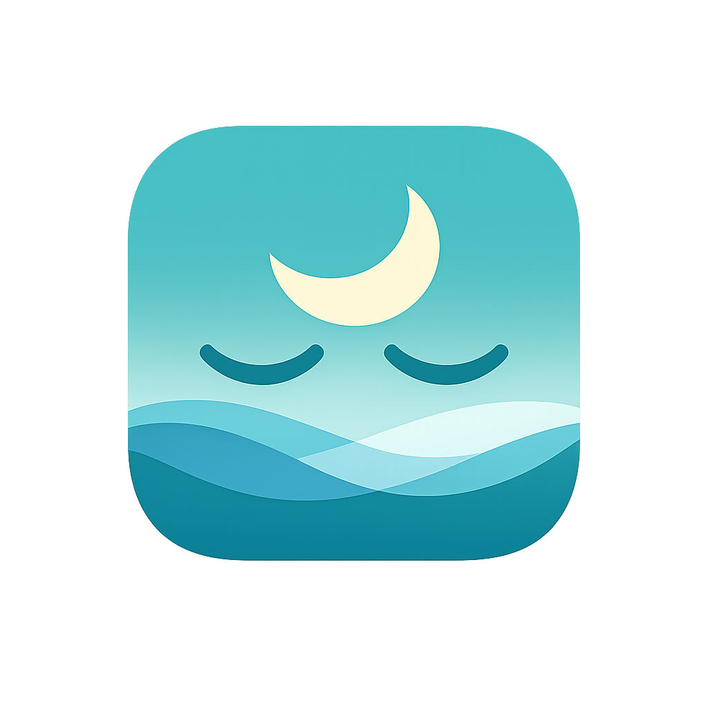

# GazeGuard

<div align="center">
  
  <h3 align="center">GazeGuard</h3>
</div>

GazeGuard is a break reminder for people who spend long periods looking at a screen. It runs a countdown, warns before breaks, and guides you through short and long eye-rest breaks. Desktop breaks can pause your work with a dedicated fullscreen window. GazeGuard supports Windows, macOS, Linux, and Android.

## Quick Start

1. Download the [latest release](https://github.com/JorgeReus/GazeGuard/releases/latest) for your platform.
2. Install and launch GazeGuard.
3. Adjust the schedule in **Settings**.
4. Leave GazeGuard running so it can remind you when it is time to take a break.

Use **Test Break** in Settings to preview the break experience.

## What It Does

- Runs short and long break schedules.
- Shows a warning before each break.
- Displays eye exercises and other configurable break activities.
- Supports random break order, sound, animation, and themes.
- Lets you postpone or skip breaks when allowed.
- Supports strict breaks when skipping should be disabled.
- Can pause during fullscreen apps or when you are idle.
- Can start automatically at login on supported desktop platforms.
- Saves settings and break state locally.
- Provides Android notifications and a background reminder service.
- Checks for desktop updates from the Settings window.

## Installation

### Android

Download the universal APK from the [GitHub releases page](https://github.com/JorgeReus/GazeGuard/releases), open it on your phone, and approve installation from that source if Android asks.

The current release APK is unsigned for development/testing, so Android may show an additional warning.

### macOS

Download the universal DMG, open it, and drag GazeGuard to Applications. The DMG includes Apple Silicon (`arm64`) and Intel (`x86_64`) binaries.

The current CI build is unsigned and not notarized. If macOS blocks it, Control-click the app, choose **Open**, or approve it under **System Settings → Privacy & Security**.

### Windows

Download the Windows release from the [latest releases](https://github.com/JorgeReus/GazeGuard/releases/latest) page and install it on your PC.

### Linux

Release builds include AppImage, Debian (`.deb`), and RPM (`.rpm`) packages. Download the package appropriate for your distribution from [Releases](https://github.com/JorgeReus/GazeGuard/releases).

## Configuration

GazeGuard creates a YAML configuration file on first launch.

On macOS and Linux:

```text
~/.config/GazeGuard/config.yaml
```

On Windows:

```text
%APPDATA%\\GazeGuard\\config.yaml
```

The easiest way to edit configuration is through the Settings window. Changes include:

- break intervals and durations
- pre-break warning time
- postpone durations and skip limits
- short- and long-break activities
- notifications, sound, eye exercises, and animated guidance
- light, dark, or system theme
- strict breaks, random order, and persistence
- start at login, fullscreen pausing, and idle pausing
- diagnostic log level

Example configuration:

```yaml
short_break_interval: 15
short_break_duration: 15
long_break_interval: 75
long_break_duration: 60
pre_break_warning_time: 10
postpone_options:
  - duration: 5
    unit: minutes
  - duration: 10
    unit: minutes
strict_break: false
pause_during_fullscreen: true
pause_when_idle: false
theme: system
log_level: info
```

Durations for short breaks and pre-break warnings are in seconds. Break intervals and long-break durations are in minutes.

## Development

### Requirements

- Node.js and npm
- Rust stable and Cargo
- cargo-nextest
- Tauri CLI 2.10.1
- Java 21 and Android SDK platform 36 for Android builds
- macOS with Xcode command-line tools for macOS builds

Install the pinned Tauri CLI:

```bash
cargo install tauri-cli --version 2.10.1 --locked
```

Install JavaScript dependencies and start the frontend:

```bash
npm install
npm run dev
```

Build the frontend:

```bash
npm run build
```

Run Rust tests:

```bash
cd src-tauri
cargo nextest run
```

Run the macOS-compatible WebdriverIO end-to-end suite:

```bash
npm run test:e2e
```

Linux development also needs the Tauri system libraries:

```bash
sudo apt-get update
sudo apt-get install -y \
  build-essential libayatana-appindicator3-dev libssl-dev \
  libwebkit2gtk-4.1-dev libxdo-dev librsvg2-dev
```

## Build Packages

### Android Universal APK

```bash
cd src-tauri
cargo tauri android init --ci --skip-targets-install
cargo tauri android build --apk --target aarch64 armv7 i686 x86_64 --ci
```

Output:

```text
src-tauri/gen/android/app/build/outputs/apk/universal/release/app-universal-release-unsigned.apk
```

### macOS Universal DMG

```bash
cd src-tauri
cargo tauri build --target universal-apple-darwin --bundles dmg --no-sign --ci
```

### Linux Packages

```bash
cd src-tauri
cargo tauri build --bundles appimage,deb,rpm --ci
```

## CI And Releases

- Pull requests run Rust tests, Android tests, and WebdriverIO tests.
- Pushes to `main` run Release Please and create or update a release PR.
- Merging a release PR creates a `v*` tag.
- Version tags build and publish Android, macOS, and Linux release artifacts.

Release Please updates the version in `package.json`, `src-tauri/tauri.conf.json`, and `src-tauri/Cargo.toml`.

## Signing And Distribution

Current CI artifacts are intended for development/testing:

- Android APK: unsigned
- macOS DMG: unsigned and not notarized

Before public distribution, configure Android signing and macOS Developer ID signing/notarization. Keep signing keys in encrypted CI secrets, never in the repository.

The desktop updater also requires `TAURI_SIGNING_PRIVATE_KEY` and `TAURI_SIGNING_PRIVATE_KEY_PASSWORD`. The matching public key is stored in `src-tauri/tauri.conf.json`.

## Troubleshooting

`tauri.settings.gradle does not exist`:

```bash
cd src-tauri
cargo tauri android init --ci --skip-targets-install
```

`glib-2.0 was not found` on Linux: install the Linux dependencies listed above.

Android rejects an APK update: uninstall an incompatible signed build or use `adb install -r`. Android may reject updates signed with a different key.

macOS refuses to open the app: the artifact is unsigned. Use **Open** from Finder's context menu or install a signed/notarized build.

## License

Distributed under the MIT License. See [LICENSE](./LICENSE) for details.
